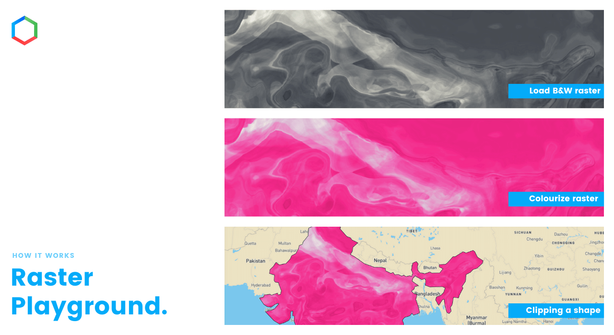

[](https://app.netlify.com/sites/raster-playground/deploys) [](https://github.com/blueskyanalytics/raster-playground/stargazers) [](https://github.com/blueskyanalytics/raster-playground/issues)

# Raster Playground
> A color playground for raster maps.



## Why we made raster playground?

Raster manipulation (colorisation & clipping of tiles) is computationally heavy operation & not very feasible on the browser (frontend), thus we moved it to backend & then distributed by the CDN.

But this raised another challenge, how do we settle on the color schemes with backend, since the whole pipeline had to be rerun & old tiles purged? Earlier, we could just change the value & reload browser!

This utility helps simulate the color schemes quickly, along with clipping & map-styles you want to apply.

## Features
- [X] Raster color manipulation 
- [X] All state in url
- [X] Monochromatic tiles URL as an input
- [ ] Clip as shape (for better visualisation)
    - [X] Shape file through Url
    - [ ] Shape file through uploads (from local system)
    - [X] Format available - TopoJson
    - [ ] More formats required (Geojson etc)
    - [X] Auto fit to shape file location (on file load)
- [ ] Color selector 
    - [X] Add colors
    - [X] Remove colors
    - [ ] Color ordering 
    - [X] Alpha color (0 - transparent)
    - [X] Copy color in different format - HEX, RGBA, HSLA (JSON)
    - [ ] Download color format for ASE, GIMP/Inscape color scheme
- [ ] Mobile version 
- [X] Search bar to search places 
- [X] Go to current location
- [X] Dark Mode

## Installation
clone repo and install using - 
```sh
npm install
```

## Run on local
```sh
npm run start
```

## Build project
```sh
npm run build
```

## How to use
- Use chrome for better usability (Because initial stage of development)
- Add monochromatic tiles URL (XYZ format) eg - `https://your-tiles-url/{z}/{x}/{-y}.png`
- Add shape file URL (TopoJSON format) <optional>
- Add some colour pallet to visualise colors on raster map
- Add alpha (opacity) value (between 0-1) <optional>
- If you get the desired visualisation, you can copy RGBA (JSON) and use it to generate colour tiles from the backend or send the link to your colleague/friends to verify.

## How to contribute
Read contribution [here](CONTRIBUTING.md)
    

    
[](https://github.com/blueskyanalytics/raster-playground/issues)
